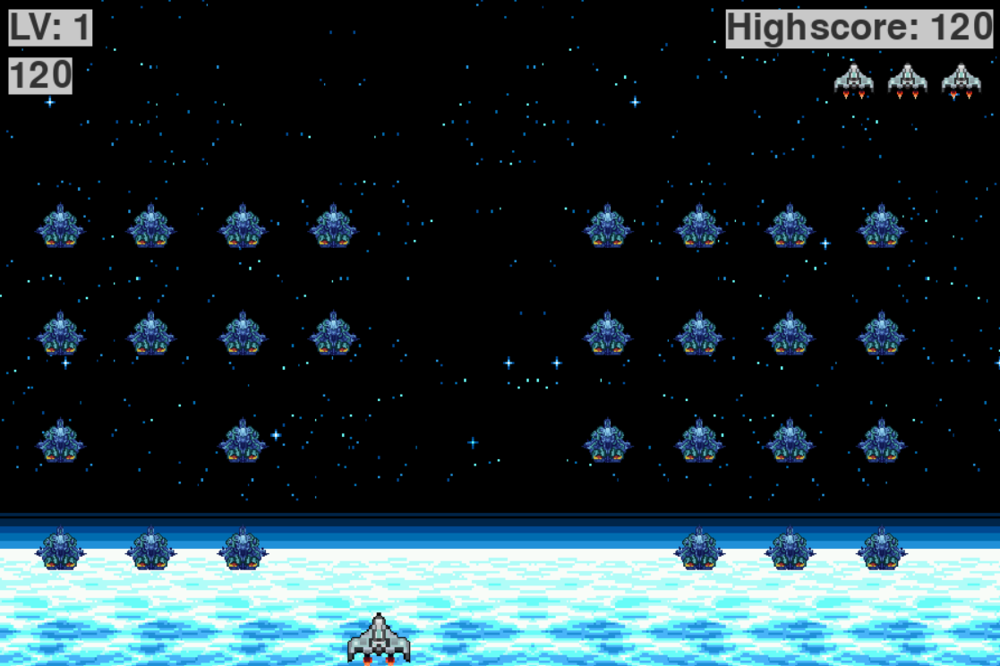

# Alien Invasion


Redesigned and programmed based off the classic Space Invader for Arcade in pygame framework    

## How to run the project

require Python3, pygame 

```
pip install pygame
py game.py
```
## How to play

- Esc: exit the game/return to menu
- Enter: enter the game
- M: mute the music
- Right/Left arrow: move the space ship 
- Space: shoot 

*to reset the highscore, go to data.json and replace the current highscore with 0*


## Demo

</img>

<a href="https://github.com/hoangdesu">Instructor: @hoangdesu</a>
